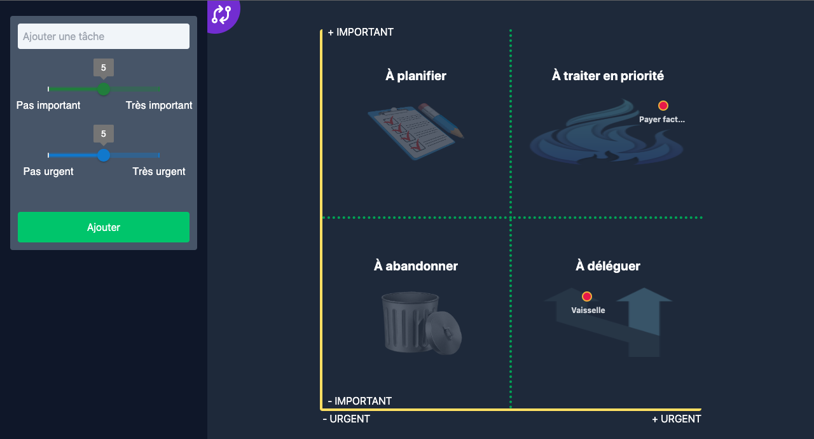

# EisenhowerTodoApp

## Table of contents

- [Overview](#overview)

  - [Functionalities](#functionalities)
  - [Screenshots](#screenshots)
  - [Links](#links)
  - [Built with](#built-with)

- [Author](#author)

## Overview

Here is the "EinsenhowerTodoApp". Add a todo, associate it to an importance rating and an urgency rating. Then visualize your tasks on a list view, or better, on an Eisenhower matrix ! It will help you to see in the blink of an eye which task you have to prioritize, and which one you could throw away !

### Functionalities

- Add todo (task name, importance rating, urgency rating)
- Switch on different view : list view or Eisenhower matrix view
- On list view: filtering (all, active or completed) / sorting (by task, importance or urgency) / remove one todo or all completed todos
- On matrix view: left click to complete task / right click to remove task
- Persist data into localStorage
- Responsive
- Errors management

### Screenshots

### Links

- [Live website](https://todo-app-samyleedev.vercel.app/)

### Built with

- [React](https://reactjs.org/)
- [Redux Toolkit](https://redux-toolkit.js.org/)
- [TailWind CSS](https://tailwindcss.com/)
- [MUI](https://mui.com/)

## Author

My portfolio : [samyleedev.fr](https://www.samyleedev.fr/)
